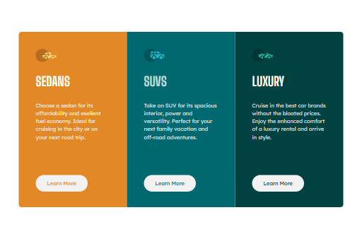

# Frontend Mentor - 3-column preview card component solution

This is a solution to the [3-column preview card component challenge on Frontend Mentor](https://www.frontendmentor.io/challenges/3column-preview-card-component-pH92eAR2-). Frontend Mentor challenges help you improve your coding skills by building realistic projects.

## Table of contents

- [Overview](#overview)
  - [The challenge](#the-challenge)
  - [Screenshot](#screenshot)
  - [Links](#links)
- [My process](#my-process)
  - [Built with](#built-with)
  - [What I learned](#what-i-learned)
  - [Continued development](#continued-development)
  - [Useful resources](#useful-resources)
- [Author](#author)

## Overview

### The challenge

Users should be able to:

- View the optimal layout depending on their device's screen size
- See hover states for interactive elements

### Screenshot
**Mobile**\

**Desktop**\


### Links

- Solution URL: [Add solution URL here](https://www.frontendmentor.io/solutions/responsive-three-card-component-using-tailwind-css-nE0dcOCO7m)
- Live Site URL: [Add live site URL here](https://acekant.github.io/fm-three-column-component/)

## My process

### Built with

- Semantic HTML5 markup
- Tailwind CSS
- Flexbox
- Mobile-first workflow

### What I learned

During this challenge, I improved my understanding of **Tailwind's spacing utilities** and **flexbox layouts**. One key takeaway was how to efficiently align items using `space-x-*` and `space-y-*` utilities.

```html
<div class="flex flex-col space-y-4">
  <div class="p-4 bg-orange-500">Card 1</div>
  <div class="p-4 bg-blue-500">Card 2</div>
</div>
```

### Continued development

Going forward, I want to:

- Work on **more complex layouts** using Tailwind Grid.
- Improve **accessibility practices**.
- Learn about **Tailwind's JIT mode** for optimization.

### Useful resources

- [Tailwind CSS Documentation](https://tailwindcss.com/docs) - This helped me understand spacing and flexbox utilities.
- [Frontend Mentor](https://www.frontendmentor.io) - Great place to practice real-world UI challenges.

## Author

- Frontend Mentor - [@acekant](https://www.frontendmentor.io/profile/yourusername)
- GitHub - [@acekant](https://github.com/yourusername)
